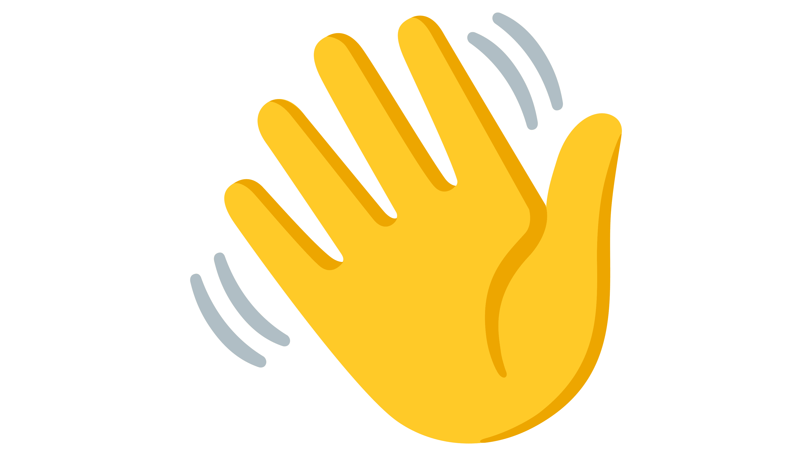
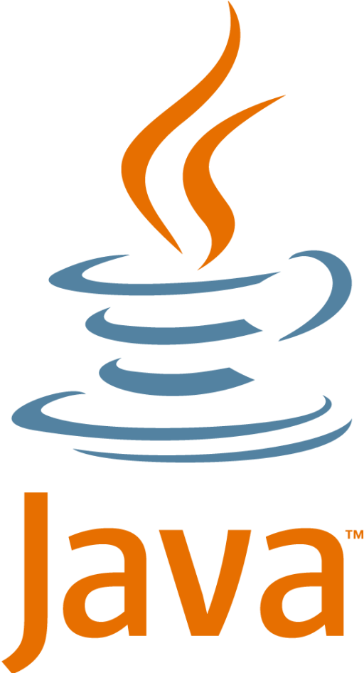

# Hello! 

## My name is Varun Lagadapati!

### Key Skills and Programming Languages:

 

### Interests:

- Data Science
- Artificial Intelligence
- Machine Learning
- Computer Vision
- Deep Learning
- Natural Language Processing

Feel free to reach out via email varunlaga7@gmail.com
